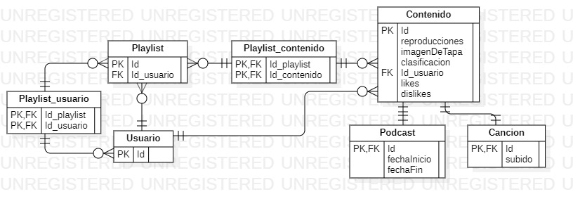
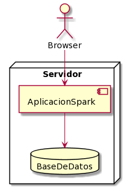
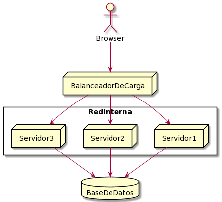

# parcial-2canciones-solucion

[Enunciado](https://docs.google.com/document/d/1DGIFDVIsxbbpffSTyDEaR2m37GF4XSbDoXrUKoctvs4/edit#heading=h.gt33t48149l1)

# Resolución

## Parte A - Persistencia

```java
//Voy por la estrategia de single table para poder realizar consultas polimórficas por un lado. Por otro lado, es mejor en cuanto a performance y no perdemos demasiado en normalización teniendo en cuenta los pocos atributos que posee cada subclase.
//Ademas vuelvo a la clase una clase abstracta, ya que no veo que tenga sentido instanciar un objeto de la clase Contenido.
@Entity
@Inheritance(InheritanceStrategy=SINGLE_TABLE)
@DiscriminatorColum(name="tipo")
abstract class Contenido{
@Id
@GeneratedValue
long Id
reproducciones
imagenDeTapa
@Enumerated
Clasificacion clasificacion
@ManyToOne
Usuario propietario
@Embedded
Estadistica estadistica
}

@Entity
@DiscriminatorValue(value="Podcast")
class Podcast extends Contenido{
fechaInicio
fechaFin
}

@Entity
@DiscriminatorValue(value="Cancion")
class Cancion extends Contenido{
duracion
LocalDate subido
}

@Embedable
class Estadistica{
likes
dislikes
}

@Entity
class Usuario{
@Id
@GeneratedValue
long Id
}

//La interface Clasificacion se transforma en un enum con comportamiento.
enum Clasificacion{
Menores,
Adolescentes,
Adultos,

/*
Implementar validarAcceso
*/
}

@Entity
class Playlist{
@Id
@GeneratedValue
long Id
@ManyToOne
Usuario propietario
@ManyToMany
Colecction<Usuario> suscriptores
@ManyToMany
@OrderColum(name="posicion")
List<Contenido> contenidos
@Enumerated
Visibilidad visibilidad
}

//Los enums no requieren ser anotados.
enum Visibilidad{
PRIVADA,
PUBLICA,
NO_LISTADA,
}
```

### Diagrama de entidad relación



## Parte B - Interfaz REST

### Perfil de usuario

1. Consultar usuario
```http
get /usuario
get /me
```
2. Editar usuario
```http
put /usuario
put /me
body:
{
nombre: "unNombre",
apellido: "unApellido",
email: "unEmail"
}
```

### Reproductor de canciones

1. Buscar canciones
```http
get /canciones/?cancion=unaCancion
```
2. Iniciar reproducción
```http
put /canciones/:id/reproducciones
```
3. Me gusta
```http
put /canciones/:id/like
delete /canciones/:id/like
```
### Editor de listas de reproducción
1. Visualizar playlist
```http
get /playlist/:id
```
2. Eliminar canciones
```http
delete /playlist/:id/canciones/:id
```
3. Guardar cambios
```http
patch /playlist/:id/canciones/:id
body:
{
nombre: "unNombre",
canciones: [
            {
            ...
            },
            ...
           ]
}
```
## Parte C - Arquitectura

### Arquitectura 1


Esta arquitectura no tiene ninguna tolerancia a fallos, se encuentra totalmente dentro de un servidor. Cada componente puede comportarse como un SPOF (base de datos, aplicación, servidor).
Con respecto a escalabilidad, esta arquitectura solo puede escalar verticalmente, si lo hiciese de forma horizontal sería un cambio de arquitectura.

### Arquitectura 2


Esta arquitectura es más tolerable a errores que la anterior, pueden fallar hasta 2 servidores antes de que la aplicación deje de funcionar por completo. La Base de datos y el balanceador de cargas siguen siendo grandes SPOF.
En cuanto a escalabilidad, se puede escalar tanto vertical como horizontalmente: Agregando más servidores o ampliando el hardware de cada servidor.
Utilizando esta estrategia, se debe tener en cuenta que todos los servidores realizan consultas a una misma base de datos, por lo que se requiere pensar en alguna opción que maneje la concurrencia.
